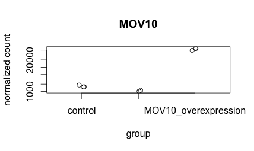

# Introduction to R practice

## Creating vectors/factors and dataframes

1. We are performing RNA-Seq on cancer samples being treated with three different types of treatment (A, B, and P). You have 12 samples total, with 4 replicates per treatment. Write the R code you would use to construct your metadata table as described below.  
     - Create the vectors/factors for each column (Hint: you can type out each vector/factor, or if you want the process go faster try exploring the `rep()` function).
     - Put them together into a dataframe called `meta`.
     - Use the `rownames()` function to assign row names to the dataframe (Hint: you can type out the row names as a vector, or if you want the process go faster try exploring the `paste()` function).

     Your finished metadata table should have information for the variables `sex`, `stage`, `treatment`, and `myc` levels: 

     | |sex	| stage	| treatment	| myc |
     |:--:|:--: | :--:	| :------:	| :--: |
     |sample1|	M	|I	|A	|2343|
     |sample2|	F	|II	|A	|457|
     |sample3	|M	|II	|A	|4593|
     |sample4	|F	|I	|A	|9035|
     |sample5|	M	|II	|B	|3450|
     |sample6|	F|	II|	B|	3524|
     |sample7|	M|	I|	B|	958|
     |sample8|	F|	II|	B|	1053|
     |sample9|	M|	II|	P|	8674|
     |sample10	|F|	I	|P	|3424|
     |sample11|	M	|II	|P	|463|
     |sample12|	F|	II|	P|	5105|

 
## Subsetting vectors/factors and dataframes

2. Using the `meta` data frame from question #1, write out the R code you would use to perform the following operations (questions **DO NOT** build upon each other):

     - return only the `treatment` and `sex` columns using `[]`:
     - return the `treatment` values for samples 5, 7, 9, and 10 using `[]`:
     - use `filter()` to return all data for those samples receiving treatment `P`:
     - use `filter()`/`select()`to return only the `stage` and `treatment` data for those samples with `myc` > 5000:
     - remove the `treatment` column from the dataset using `[]`:
     - remove samples 7, 8 and 9 from the dataset using `[]`:
     - keep only samples 1-6 using `[]`:
     - add a column called `pre_treatment` to the beginning of the dataframe with the values T, F, F, F, T, T, F, T, F, F, T, T (Hint: use `cbind()`): 
     - change the names of the columns to: "A", "B", "C", "D":
 
## Extracting components from lists
3. Create a new list, `list_hw` with three components, the `glengths` vector, the dataframe `df`, and `number` value. Use this list to answer the questions below . `list_hw` has the following structure (NOTE: the components of this list are not currently named):

          [[1]]
          [1]   4.6  3000.0 50000.0 

          [[2]]
                 species  glengths 
            1    ecoli    4.6
            2    human    3000.0
            3    corn     50000.0

          [[3]]
          [1] 8

Write out the R code you would use to perform the following operations (questions **DO NOT** build upon each other):
 - return the second component of the list:
 - return `50000.0` from the first component of the list:
 - return the value `human` from the second component: 
 - give the components of the list the following names: "genome_lengths", "genomes", "record":
   
## Creating figures with ggplot2

4. Create the same plot as above using ggplot2 using the provided metadata and counts datasets. The [metadata table](https://github.com/hbc/Intro-to-R-2-day/raw/master/data/Mov10_full_meta.txt) describes an experiment that you have setup for RNA-seq analysis, while the [associated count matrix](https://github.com/hbc/Intro-to-R-2-day/raw/master/data/normalized_counts.txt) gives the normalized counts for each sample for every gene. Download the count matrix and metadata using the links provided.

     Follow the instructions below to build your plot. Write the code you used and provide the final image.

     - Read in the metadata file using: `meta <- read.delim("Mov10_full_meta.txt", sep="\t", row.names=1)`

     - Read in the count matrix file using: `data <- read.delim("normalized_counts.txt", sep="\t", row.names=1)`

     - Create a vector called `expression` that contains the normalized count values from the row in normalized_counts that corresponds to the MOV10 gene.  

     - Check the class of this expression vector. Then, convert it to a numeric vector using `as.numeric(expression)`

     - Bind that vector to your metadata data frame (`meta`) and call the new data frame `df`. 

     - Create a ggplot by constructing the plot line by line:
     
          - Initialize a  ggplot with your `df` as input.

          - Add the `geom_jitter()` geometric object with the required aesthetics which are x and y.

          - Color the points based on `sampletype`

          - Add the `theme_bw()` layer 

          - Add the title "Expression of MOV10" to the plot

          - Change the x-axis label to be blank

          - Change the y-axis label to "Normalized counts"

          - Using `theme()` change the following properties of the plot:

               - Remove the legend (Hint: use ?theme help and scroll down to legend.position)

               - Change the plot title size to 1.5x the default and center align

               - Change the axis title to 1.5x the default size

               - Change the size of the axis text only on the y-axis to 1.25x the default size
               
               - Rotate the x-axis text to 45 degrees using `axis.text.x=element_text(angle=45, hjust=1)`

## Practice with nested functions (optional)

Let's derive some nested functions similar to those we will use in our RNA-Seq analysis. The following dataframes, `value_table` and `meta`, should be used to address the questions below (you do not actually need to create these dataframes):

**value_table**

| |MX1|	MX2|	MX3|
|:--: |:--:|	:--:|	:--:|
|KD.2	|-222517.197	|-21756.82	|-16036.035|
|KD.3	|17453.907	|-30058.14	|-25837.482|
|OE.1	|-31247.923|	73061.38	|7019.940|
|OE.2	|-4184.355	|61994.47	|1777.858|
|OE.3|	147391.709	|11970.45	|-18663.686|
|IR.1|	-32247.617	|-27896.01	|29383.153|
|IR.2	|25456.820|	-30714.29	|19148.752|
|IR.3	|99894.656|	-36601.04|	3207.501|

**meta**

| |sampletype|	MOVexpr|
|:--: |:--:|	:--:|
|KD.2|	MOV10_knockdown	|low|
|KD.3	|MOV10_knockdown|	low|
|OE.1	|MOV10_overexpression	|high|
|OE.2|	MOV10_overexpression|	high|
|OE.3	|MOV10_overexpression	|high|
|IR.1	|siRNA|	normal|
|IR.2	|siRNA|	normal|
|IR.3|	siRNA	|normal|

5. We would like to count the number of samples which have normal Mov10 expression (`MOVexpr`) in the `meta` dataset. Let's do this in steps:
 
   - Write the R code you would run to return the row numbers of the samples with `MOVexpr` equal to "normal": 

   - Write the R code you would run to determine the number of elements in the `MOVexpr` column: 

   - Now, try to combine your first two actions into a single line of code using nested functions to determine the number of elements in the MOVexpr column with expression levels of MOV10 being normal: 

6. Now we would like to add the `MX1` and `MX3` columns to the `meta` data frame. Let's do this in steps:

   - Write the R code you would run to extract columns `MX1` and `MX3` from the `value_table` and to save it to a variable `mx` (hint: you will need to use the `c()` function to specify the columns you want to extract): 

   - Using the `cbind()` function, write the R code you would use to add the columns in your `mx` variable to the end of your `meta` dataset : 
 
   - Now, try to combine your first two actions into a single line of code using nested functions (hint: you do not need to generate the `mx` variable) to add the `MX1` and `MX3` columns to the `meta` file: 

7. Finally, we would like to extract only those rows from the `meta` dataset for replicate 2 from all conditions (KD.2, OE.2, IR.2). Let's do this in steps:
 
   - Write the function you would use to determine the row names of the `meta` dataset: 

   - Using the `which()` function, write the R code you would run to determine the location of the row name `KD.2` in the `meta` dataset: 

   - Using the `which()` function, write the R code you would use to determine the location of row names `KD.2`, `OE.2`, and `IR.2` in the `meta` dataset (use the OR operator ("\|") to return multiple locations):
 
   - Now, extract the rows from the `meta` dataset with row names `KD.2`, `OE.2`, and `IR.2` using a single line of code using nested functions: 
