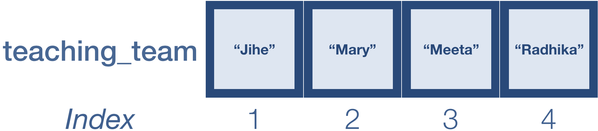

Approximate time: 110 min


## Learning Objectives

* Implement matching and re-ordering data within data structures.

## Matching data 

Often when working with genomic data, we have a data file that corresponds with our metadata file. The data file contains measurements from the biological assay for each individual sample. In this case, the biological assay is gene expression and data was generated using RNA-Seq. 

Let's read in our expression data (RPKM matrix) that we downloaded previously:

```r
rpkm_data <- read.csv("data/counts.rpkm.csv")
```

>**NOTE:** If the data file name ends with `txt` instead of `csv`, you can read in the data using the code: `rpkm_data <- read.csv("data/counts.rpkm.txt")`. 

Take a look at the first few lines of the data matrix to see what's in there.

```r
head(rpkm_data)
```

It looks as if the sample names (header) in our data matrix are similar to the row names of our metadata file, but it's hard to tell since they are not in the same order. We can do a quick check of the number of columns in the count data and the rows in the metadata and at least see if the numbers match up. 

```r
ncol(rpkm_data)
nrow(metadata)
```

What we want to know is, **do we have data for every sample that we have metadata?** 

## The `%in%` operator
 
Although lacking in [documentation](http://dr-k-lo.blogspot.com/2013/11/) this operator is well-used and convenient once you get the hang of it. The operator is used with the following syntax: 

```r
vector1_of_values %in% vector2_of_values
```

It will take a vector as input to the left and will **evaluate each element to see if there is a match in the vector that follows on the right of the operator.** *The two vectors do not have to be the same size.* This operation will return a vector of the same length as vector1 containing logical values to indicate whether or not there was a match. Take a look at the example below:

```r
A <- c(1,3,5,7,9,11)   # odd numbers
B <- c(2,4,6,8,10,12)  # even numbers

# test to see if each of the elements of A is in B	
A %in% B
```

```r
## [1] FALSE FALSE FALSE FALSE FALSE FALSE
```

Since vector A contains only odd numbers and vector B contains only even numbers, there is no overlap and so the vector returned contains a `FALSE` for each element. Let's change a couple of numbers inside vector B to match vector A:


```r
A <- c(1,3,5,7,9,11)   # odd numbers
B <- c(2,4,6,8,1,5)  # add some odd numbers in 
```

```r
# test to see if each of the elements of A is in B
A %in% B
```

```r
## [1]  TRUE FALSE  TRUE FALSE FALSE FALSE
```

The logical vector returned denotes which elements in `A` are also in `B` and which are not.  

We saw previously that we could use the output from a logical expression to subset data by returning only the values corresponding to `TRUE`. Therefore, we can use the output logical vector to subset our data, and return only those elements in `A`, which are also in `B` by returning only the TRUE values:


```r
intersection <- A %in% B
intersection
```


```r
A[intersection]
```


In these previous examples, the vectors were small and so it's easy to count by eye; but when we work with large datasets this is not practical. A quick way to assess whether or not we had any matches would be to use the `any` function to see if **any of the values contained in vector A are also in vector B**:

```r
any(A %in% B)
```

The `all` function is also useful. Given a logical vector, it will tell you whether all values returned are `TRUE`. If there is at least one `FALSE` value, the `all` function will return a `FALSE` and you know that all of A are not contained in B.

```r
all(A %in% B)
```
***
[**Exercise 1**](../results/answer_keys/07_matching_answer_key.md#exercise-1-solution)

1. Using the `A` and `B` vectors created above, evaluate each element in `B` to see if there is a match in `A`

2. Subset the `B` vector to only return those values that are also in `A`.

***
Suppose we had **two vectors that had the same values but just not in the same order**. We could also use `all` to test for that. Rather than using the `%in%` operator we would use `==` and compare each element to the same position in the other vector. Unlike the `%in%` operator, **for this to work you must have two vectors that are of equal length**.

```r
A <- c(10,20,30,40,50)
B <- c(50,40,30,20,10)  # same numbers but backwards 

# test to see if each element of A is in B
A %in% B

# test to see if each element of A is in the same position in B
A == B

# use all() to check if they are a perfect match
all(A == B)

```

Let's try this on our data and see whether we have metadata information for all samples in our expression data. We'll start by creating two vectors; one with the `rownames` of the metadata and `colnames` of the RPKM data. These are base functions in R which allow you to extract the row and column names as a vector:

```r
x <- rownames(metadata)
y <- colnames(rpkm_data)
```

Now check to see that all of `x` are in `y`:

```r
all(x %in% y)
```

*Note that we can use nested functions in place of `x` and `y`:*

```r
all(rownames(metadata) %in% colnames(rpkm_data))
```

We know that all samples are present, but are they in the same order:

```r
all(rownames(metadata) == colnames(rpkm_data))
```

**Looks like all of the samples are there, but will need to be reordered. To reorder our genomic samples, we need to first learn different ways to reorder data. Therefore, we will step away from our genomic data briefly to learn about reordering, then return to it at the end of this lesson.**

***
[**Exercise 2**](../results/answer_keys/07_matching_answer_key.md#exercise-2-solution)

We have a list of 6 marker genes that we are very interested in. Our goal is to extract count data for these genes using the `%in%` operator from the `rpkm_data` data frame, instead scrolling through `rpkm_data` and finding them.

First, let's create a vector called `important_genes` with the Ensembl IDs of the 6 genes we are interested in:

```r
important_genes <- c("ENSMUSG00000083700", "ENSMUSG00000080990", "ENSMUSG00000065619", "ENSMUSG00000047945", "ENSMUSG00000081010", "ENSMUSG00000030970")
```

1. Use the `%in%` operator to determine if all of these genes are in the row names of the `rpkm_data` data frame.	
	
2. Extract the rows from `rpkm_data` that correspond to these 6 genes using `[]` and the `%in%` operator. Double check the row names to ensure that you are extracting the correct rows.

3. **Bonus question:** Extract the rows from `rpkm_data` that correspond to these 6 genes using `[]`, but without using the `%in%` operator.

***

## Reordering data using indices
Indexing `[ ]` can be used to extract values from a dataset as we saw earlier, but we can also use it to rearrange our data values. 

```r
teaching_team <- c("Jihe", "Mary", "Meeta", "Radhika")
```


Remember that we can return values in a vector by specifying it's position or index:

```r
teaching_team[c(2, 4)] # Extracting values from a vector
teaching_team
```

We can also extract the values and reorder them:

```r
teaching_team[c(4, 2)] # Extracting values and reordering them
```

Similarly, we can extract all of the values and reorder them:

```r
teaching_team[c(4, 2, 1, 3)]
```

If we want to save our results, we need to assign to a variable:

```r
reorder_teach <- teaching_team[c(4, 2, 1, 3)] # Saving the results to a variable
```

## The `match` function

Now that we know how to reorder using indices, we can use the `match()` function to match the values in two vectors. We'll be using it to evaluate which samples are present in both our counts and metadata dataframes, and then to re-order the columns in the counts matrix to match the row names in the metadata matrix. 

`match()` takes at least 2 arguments: 

1. a vector of values in the order you want
2. a vector of values to be reordered

The function returns the position of the matches (indices) with respect to the second vector, which can be used to re-order it so that it matches the order in the first vector.  Let's create vectors `first` and `second` to demonstrate how it works:

```r
first <- c("A","B","C","D","E")
second <- c("B","D","E","A","C")  # same letters but different order
```


***How would you reorder `second` vector to match `first` using indices?***

If we had large datasets, it would be difficult to reorder them by searching for the indices of the matching elements. This is where the `match` function comes in really handy:
	
```r
match(first,second)
[1] 4 1 5 2 3
```

The function should return a vector of size `length(first)`. Each number that is returned represents the index of the `second` vector where the matching value was observed. 

Now, we can just use the indices to reorder the elements of the `second` vector to be in the same positions as the matching elements in the `first` vector:

```r
reorder_idx <- match(first,second) # Saving indices for how to reorder `second` to match `first`

second[reorder_idx]  # Reordering the second vector to match the order of the first vector
second_reordered <- second[reorder_idx]  # Reordering and saving the output to a variable
```


Now that we know how `match()` works, let's change vector `second` so that only a subset are retained:

```r	
first <- c("A","B","C","D","E")
second <- c("D","B","A")  # remove values
```


And try to `match()` again:

```r
match(first,second)

[1]  3  2 NA  1 NA
```

>**NOTE:** For values that don't match by default return an `NA` value. You can specify what values you would have it assigned using `nomatch` argument. Also, if there is more than one matching value found only the first is reported.

### Reordering genomic data using `match()` function

Using the `match` function, we now would like to match the row names of our metadata to the column names of our expression data*, so these will be the arguments for `match`. Using these two arguments we will retrieve a vector of match indices. The resulting vector represents the re-ordering of the column names in our data matrix to be identical to the rows in metadata:
 
 ```r
rownames(metadata)
	
colnames(rpkm_data)
	
genomic_idx <- match(rownames(metadata), colnames(rpkm_data))
genomic_idx
```

Now we can create a new data matrix in which columns are re-ordered based on the match indices:

```r
rpkm_ordered  <- rpkm_data[,genomic_idx]
```

Check and see what happened by using `head`. You can also verify that column names of this new data matrix matches the metadata row names by using the `all` function:

```r
head(rpkm_ordered)
all(rownames(metadata) == colnames(rpkm_ordered))
```

Now that our samples are ordered the same in our metadata and counts data, **if these were raw counts** we could proceed to perform differential expression analysis with this dataset.


---
*This lesson has been developed by members of the teaching team at the [Harvard Chan Bioinformatics Core (HBC)](http://bioinformatics.sph.harvard.edu/). These are open access materials distributed under the terms of the [Creative Commons Attribution license](https://creativecommons.org/licenses/by/4.0/) (CC BY 4.0), which permits unrestricted use, distribution, and reproduction in any medium, provided the original author and source are credited.*
