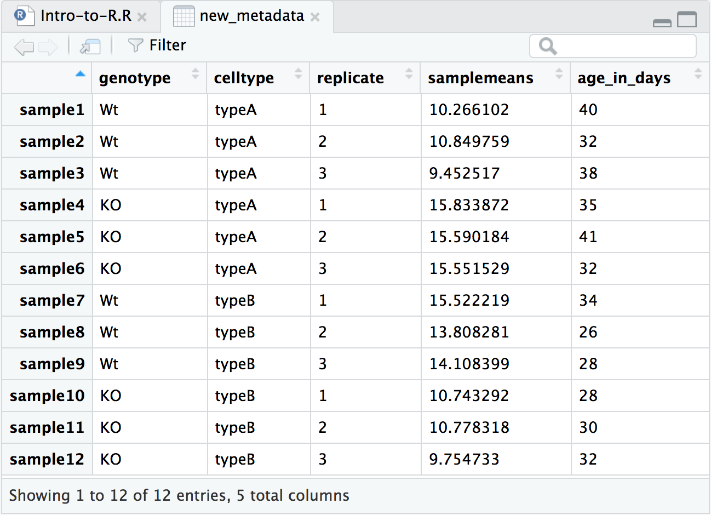
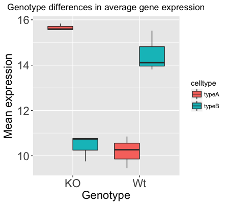

Approximate time: 60 minutes

## Learning Objectives 

* Plot graphs using the external package "ggplot2".
* Use the "map" function for iterative tasks on data structures.
* Export plots for use outside of the R environment.

## Setting up a data frame for visualization

In this lesson we want to make plots to evaluate the average expression in each sample and its relationship with the age of the mouse. So, to this end, we will be adding a couple of additional columns of information to the `metadata` data frame that we can utilize for plotting. 

<p align="center">

</p>

Before we get started, we need to download a new counts data frame and import it into R as a new data frame called `rpkm_ordered`.
1. Right-click [on this link](https://raw.githubusercontent.com/hbctraining/Intro-to-R/master/data/ordered_counts_rpkm.csv) and download the file into the "data" folder within your project.
1. Using `read.csv()` read in the data into R

```r
rpkm_ordered <- read.csv("data/ordered_counts_rpkm.csv")

View(rpkm_ordered)
```

### Calculating average expression

Let's take a closer look at our counts data. Each column represents a sample in our experiment, and each sample has ~38K values corresponding to the expression of different transcripts. We want to compute **the average value of expression** for each sample eventually. Taking this one step at a time, what would we do if we just wanted the average expression for Sample 1 (across all transcripts)? We can use the R base package provided function called 'mean()`:

```r
mean(rpkm_ordered$sample1)
```

That is great, if we only wanted the average from one of the samples (1 column in a data frame), but we need to get this information from all 12 samples, so all 12 columns. It would be ideal to get a vector of 12 values that we can add to the metadata data frame. What is the best way to do this?

Programming languages typically have a way to allow the execution of a single line of code or several lines of code multiple times, or in a "loop". While "for loops" are available in R, there are other easier-to-use functions that can achieve this -  for example, the `apply()` family of functions and the `map()` family of functions. 

The `map()` family is a bit more intuitive to use than `apply()` and we will be using it today. However, if you are interested in learning more about the`apply()` family of functions we have [materials available here](https://hbctraining.github.io/Intro-to-R/lessons/apply_functions.html).

To obtain **mean values for all samples** we can use the `map_dbl()` function which generates a numeric vector. 

```r
library(purrr)  # Load the purrr

samplemeans <- map_dbl(rpkm_ordered, mean) 
```

> #### The `map` family of functions
> 
> The `map()` family of functions is available from the **`purrr`** package, which is part of the tidyverse suite of packages. More detailed information is available in the [R for Data Science](http://r4ds.had.co.nz/iteration.html#the-map-functions) book. This family includes several functions, each taking a vector as input and outputting a vector of a specified type. For example, we can use these functions to execute some task/function on every element in a vector, or every column in a dataframe, or every component of a list, and so on. 
> 
> - `map()` creates a list.
> - `map_lgl()` creates a logical vector.
> - `map_int()` creates an integer vector.
> - `map_dbl()` creates a "double" or numeric vector.
> - `map_chr()` creates a character vector.
> 
> The syntax for the `map()` family of functions is: 
> 
> ```r
> ## DO NOT RUN
> map(object, function_to_apply)
> ```
> 
> If you would like to practice with the `map()` family of functions, we have [additional materials](https://hbctraining.github.io/Intro-to-R/lessons/map_purrr.html) available.

### Creating a new metadata object with additional information

Because the input was 12 columns of information the output of `map_dbl()` is a *named* vector of length 12. 

```r
# Named vectors have a name assigned to each element instead of just referring to them as indices ([1], [2] and so on)
samplemeans

# Check length of the vector before adding it to the data frame
length(samplemeans)
```

Since we have 12 rows in the data frame, we can add the 12 element vector as a column to our metadata data frame using the `data.frame()` function.
	
Before we add the new column, let's create a vector with the ages of each of the mice in our data set.

```r
# Create a numeric vector with ages. Note that there are 12 elements here
age_in_days <- c(40, 32, 38, 35, 41, 32, 34, 26, 28, 28, 30, 32)    	
```

Now, we are ready to combine the `metadata` data frame with the 2 new vectors to create a new data frame with 5 columns

```r
# Add the new vector as the last column to the new_metadata dataframe
new_metadata <- data.frame(metadata, samplemeans, age_in_days) 

# Take a look at the new_metadata object
View(new_metadata)
```

We are now ready for plotting and data visualization!

## Data Visualization with `ggplot2`

When we are working with large sets of numbers it can be useful to display that information graphically to gain more insight. In this lesson we will be plotting with the popular Bioconductor package [`ggplot2`](http://docs.ggplot2.org/).

> If you are interested in learning about plotting with base R functions, we have a short lesson [available here](basic_plots_in_r.md). 

The `ggplot2` syntax takes some getting used to, but once you get it, you will find it's extremely powerful and flexible. We will start with drawing a simple x-y scatterplot of `samplemeans` versus `age_in_days` from the `new_metadata` data frame. Please note that `ggplot2` expects a data frame as input.

Let's start by loading the `ggplot2` library:

```r
library(ggplot2)
```

The `ggplot()` function is used to **initialize the basic graph structure**, then we add to it. The basic idea is that you specify different parts of the plot using additional functions one after the other and combine them into a "code chunk" using the `+` operator; the functions in the resulting code chunk are called layers.

Let's start: 

```r
ggplot(new_metadata) # what happens? 
```

You get an blank plot, because you need to **specify additional layers** using the `+` operator.

The **geom (geometric) object** is the layer that specifies what kind of plot we want to draw. A plot **must have at least one `geom`**; there is no upper limit. Examples include:

* points (`geom_point`, `geom_jitter` for scatter plots, dot plots, etc)
* lines (`geom_line`, for time series, trend lines, etc)
* boxplot (`geom_boxplot`, for, well, boxplots!)

Let's add a "geom" layer to our plot using the `+` operator, and since we want a scatter plot so we will use `geom_point()`.

```r
ggplot(new_metadata) +
  geom_point() # note what happens here
```

Why do we get an error? Is the error message easy to decipher?

We get an error because each type of `geom` usually has a **required set of aesthetics** to be set. "Aesthetics" are set with the aes() function and can be set either nested within `geom_point()` (applies only to that layer) or within `ggplot()` (applies to the whole plot).

The `aes()` function has many different arguments, and all of those arguments take columns from the original data frame as input. It can be used to specify many plot elements including the following:

* position (i.e., on the x and y axes)
* color ("outside" color)
* fill ("inside" color) 
* shape (of points)
* linetype
* size

To start, we will specify x- and y-axis since `geom_point` requires the most basic information about a scatterplot, i.e. what you want to plot on the x and y axes. All of the other plot elements mentioned above are optional.

```r
ggplot(new_metadata) +
     geom_point(aes(x = age_in_days, y= samplemeans))
```

<p align="center">

</p>

Now that we have the required aesthetics, let's add some extras like color to the plot. We can **`color` the points on the plot based on the genotype column** within `aes()`. You will notice that there are a default set of colors that will be used so we do not have to specify. Note that the legend has been conveniently plotted for us.

```r
ggplot(new_metadata) +
  geom_point(aes(x = age_in_days, y= samplemeans, color = genotype)) 
```

<p align="center">

</p>

Let's try to have both **celltype and genotype represented on the plot**. To do this we can assign the `shape` argument in `aes()` the celltype column, so that each celltype is plotted with a different shaped data point. 

```r
ggplot(new_metadata) +
  geom_point(aes(x = age_in_days, y= samplemeans, color = genotype,
  			shape=celltype)) 
```

<p align="center">

</p>

The data points are quite small. We can adjust the **size of the data points** within the `geom_point()` layer, but it should **not be within `aes()`** since we are not mapping it to a column in the input data frame, instead we are just specifying a number. 

```r
ggplot(new_metadata) +
  geom_point(aes(x = age_in_days, y= samplemeans, color = genotype,
  			shape=celltype), size=2.25) 
```

<p align="center">

</p>

The labels on the x- and y-axis are also quite small and hard to read. To change their size, we need to add an additional **theme layer**. The ggplot2 `theme` system handles non-data plot elements such as:

* Axis label aesthetics
* Plot background
* Facet label backround
* Legend appearance

There are built-in themes we can use (i.e. `theme_bw()`) that mostly change the background/foreground colours, by adding it as additional layer. Or we can adjust specific elements of the current default theme by adding the `theme()` layer and passing in arguments for the things we wish to change. Or we can use both.

Let's add a layer `theme_bw()`. Do the axis labels or the tick labels get any larger by changing themes?

```r
ggplot(new_metadata) +
  geom_point(aes(x = age_in_days, y= samplemeans, color = genotype,
  			shape=celltype), size=3.0) +
  theme_bw() 
```

Not in this case. But we can add arguments using `theme()` to change the size of axis labels ourselves. Since we are adding this layer on top (i.e later in sequence), any features we change will override what is set in the `theme_bw()`. Here we'll **increase the size of the axes labels to be 1.5 times the default size.** When modfying the size of text we often use the `rel()` function. In this way the size we specify is relative to the default. We can also provide the number vaue as we did with the data point size, but can be cumbersome if you don't know what the default font size is to begin with. 

```r
ggplot(new_metadata) +
  geom_point(aes(x = age_in_days, y= samplemeans, color = genotype,
  			shape=celltype), size=3.0) +
  theme_bw() +
  theme(axis.title = element_text(size=rel(1.5)))			
```
 
<p align="center">

</p> 

> *NOTE:* You can use the `example("geom_point")` function here to explore a multitude of different aesthetics and layers that can be added to your plot. As you scroll through the different plots, take note of how the code is modified. You can use this with any of the different geometric object layers available in ggplot2 to learn how you can easily modify your plots! 

> *NOTE:* RStudio provide this very [useful cheatsheet](https://www.rstudio.com/wp-content/uploads/2016/11/ggplot2-cheatsheet-2.1.pdf) for plotting using `ggplot2`. Different example plots are provided and the associated code (i.e which `geom` or `theme` to use in the appropriate situation.) We also encourage you to persuse throug this useful [online reference](https://ggplot2.tidyverse.org/reference/) for working with ggplot2.


***

**Exercise**

1. The current axis label text defaults to what we gave as input to `geom_point` (i.e the column headers). We can change this by **adding additional layers** called `xlab()` and `ylab()` for the x- and y-axis, respectively. Add these layers to the current plot such that the x-axis is labeled "Age (days)" and the y-axis is labeled "Mean expression".
2. Use the `ggtitle` layer to add a title to your plot. 

*NOTE: Useful code to center your title over your plot can be done using `theme(plot.title=element_text(hjust=0.5))`.*

***

### Consistent formatting using custom functions

When publishing, it is helpful to ensure all plots have similar formatting. To do this we can create a custom function with our preferences for the theme. Remember the structure of a function is:

```r
name_of_function <- function(arguments) {
    statements or code that does something
}
```

Now, let's suppose we always wanted our theme to include the following:

```r
theme_bw() +
    theme(axis.title=element_text(size=rel(1.5)),
          plot.title=element_text(size=rel(1.5), hjust=0.5))
```

If there is nothing that we want to change when we run this, then we do not need to specify any arguments. Creating the function is simple; we can just put the code inside the `{}`:

```r
personal_theme <- function(){
  theme_bw() +
    theme(axis.title=element_text(size=rel(1.5)),
          plot.title=element_text(size=rel(1.5), hjust=0.5)) 
}
```

Now to run our personal theme with any plot, we can use this function in place of the `theme()` code:

```r
ggplot(new_metadata) +
  geom_point(aes(x=age_in_days, y=samplemeans, color=genotype, shape=celltype), size=rel(3.0)) +
  xlab("Age (days)") +
  ylab("Mean expression") +
  ggtitle("Expression with Age") +
  personal_theme()
```

## Boxplot

Now that we have all the required information for plotting with ggplot2, let's try plotting a boxplot. A boxplot provides a graphical view of the distribution of data based on a five number summary. The top and bottom of the box represent the (1) first and (2) third quartiles (25th and 75th percentiles, respectively). The line inside the box represents the (3) median (50th percentile). The whiskers extending above and below the box represent the (4) maximum, and (5) minimum of a data set. The whiskers of the plot reach the minimum and maximum values that are not outliers. 

Outliers are determined using the interquartile range (IQR), which is defined as: Q3 - Q1. Any values that exceeds 1.5 x IQR below Q1 or above Q3 are considered outliers and are represented as points above or below the whiskers. These outliers are useful to identify any unexpected observations.

1. Use the `geom_boxplot()` layer to plot the differences in sample means between the Wt and KO genotypes.
2. Use the `fill` aesthetic to look at differences in sample means between the celltypes within each genotype.
3. Add a title to your plot.
4. Add 'Genotype' as your x-axis label and 'Mean expression' as your y-axis labels.
5. Theme changes:
	* Use the `theme_bw()` function to make the background white.
	* Change the size of your axes labels to 1.5x larger than the default.
	* Change the size of your plot title to 1.5x larger than default.
	* Center the plot title.

**Our final figure should look something like that provided below.**

<p align="center">

</p>

**Code for making the boxplot above can be [found here](boxplot_solution.md)**

> *NOTE:* If you wanted to change the colors of these boxplots you would add another layer `scale_fill_manual()` to the code, and within the function specify which colors you want to use using the `values` argument.  For example, if the factor column you are coloring with has 2 levels, you will need to give 2 values as follows `scale_fill_manual(values=c("purple","orange"))`.
>
> *NOTE:* You are not restricted to colors specified as above, you have the choice of a lot of colors using their *hexadecimal code*, [click here for more information about color palettes in R](http://www.cookbook-r.com/Graphs/Colors_(ggplot2)/).

## Exporting figures to file

There are two ways in which figures and plots can be output to a file (rather than simply displaying on screen). 

(1) The first (and easiest) is to export directly from the RStudio 'Plots' panel, by clicking on `Export` when the image is plotted. This will give you the option of `png` or `pdf` and selecting the directory to which you wish to save it to. It will also give you options to dictate the size and resolution of the output image.

(2) The second option is to use R functions and have the write to file hard-coded in to your script. This would allow you to run the script from start to finish and automate the process (not requiring human point-and-click actions to save).  In R’s terminology, **output is directed to a particular output device and that dictates the output format that will be produced**.  A device must be created or “opened” in order to receive graphical output and, for devices that create a file
on disk, the device must also be closed in order to complete the output.

If we wanted to print our scatterplot to a pdf file format, we would need to initialize a plot using a function which specifies the graphical format you intend on creating i.e.`pdf()`, `png()`, `tiff()` etc. Within the function you will need to specify a name for your image, and the with and height (optional). This will open up the device that you wish to write to:

```r
## Open device for writing
pdf("figures/scatterplot.pdf")
```

If you wish to modify the size and resolution of the image you will need to add in the appropriate parameters as arguments to the function when you initialize. Then we plot the image to the device, using the ggplot scatterplot that we just created. 

```r
## Make a plot which will be written to the open device, in this case the temp file created by pdf()/png()
ggplot(new_metadata) +
  geom_point(aes(x = age_in_days, y= samplemeans, color = genotype,
  			shape=celltype), size=rel(3.0)) 
```

Finally, close the "device", or file, using the `dev.off()` function. There are also `bmp`, `tiff`, and `jpeg` functions, though the jpeg function has proven less stable than the others. 
  			
```r    
## Closing the device is essential to save the temporary file created by pdf()/png()
dev.off()
```

***Note 1:*** *You will not be able to open and look at your file using standard methods (Adobe Acrobat or Preview etc.) until you execute the `dev.off()` function.*

***Note 2:*** *In the case of `pdf()`, if you had made additional plots before closing the device, they will all be stored in the same file with each plot usually getting its own page, unless otherwise specified.*

---
*This lesson has been developed by members of the teaching team at the [Harvard Chan Bioinformatics Core (HBC)](http://bioinformatics.sph.harvard.edu/). These are open access materials distributed under the terms of the [Creative Commons Attribution license](https://creativecommons.org/licenses/by/4.0/) (CC BY 4.0), which permits unrestricted use, distribution, and reproduction in any medium, provided the original author and source are credited.*
