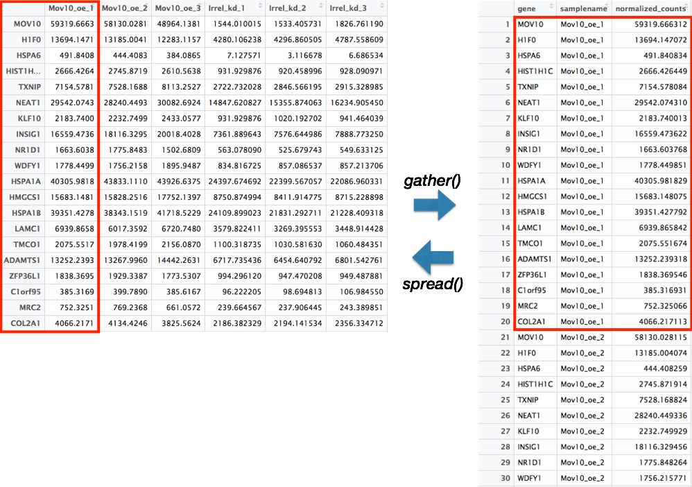

Approximate time: 75 minutes

# Data Wrangling with Tidyverse

The [Tidyverse suite of integrated packages](https://www.tidyverse.org/packages/) are designed to work together to make common data science operations more user friendly. The packages have functions for data wrangling, tidying, reading/writing, parsing, and visualizing, among others. There is a freely available book, [R for Data Science](http://r4ds.had.co.nz/index.html), with detailed descriptions and practical examples of the tools available and how they work together. We will explore the basic syntax for working with these packages, as well as, specific functions for data wrangling with the 'dplyr' package, data tidying with the 'tidyr' package, and data visualization with the 'ggplot2' package.


All of these packages use the same style of code, which is `snake_case` formatting for all function names and arguments. You can peruse the [tidy style guide](http://style.tidyverse.org/) for additional information.

## Adding files to your working directory

We will be bringing in a new file with results from a differential expression analysis, to work with in this lesson. Please right-click [here](https://github.com/hbctraining/Training-modules/raw/master/Visualization_in_R/data/Mov10oe_DE_results.csv) to download it to your `data` folder as we did before (choose to `Save Link As` or `Download Linked File As`). You should see it in `data` folder in the RStudio "Files" tab.

### Reading in the data files

Let's read in this new file we just downloaded and load the `tidyverse` library:

```r
res_tableOE <- read.csv(file = "data/Mov10oe_DE_results.csv", row.names = 1)

library(tidyverse)
```

## Tidyverse basics

The Tidyverse suite of packages introduces users to a set of data structures, functions and operators to make working with data more intuitive, but is slightly different from the way we do things in base R. **Two important new concepts we will focus on are pipes and tibbles**.

### Pipes

Stringing together commands in R can be quite daunting. Also, trying to understand code that has many nested functions can be confusing. 

To make R code more human readable, the Tidyverse tools use the pipe, `%>%`, which was acquired from the `magrittr` package and is now part of the `dplyr` package that is installed automatically with Tidyverse. **The pipe allows the output of a previous command to be used as input to another command instead of using nested functions.**

>**NOTE:** Shortcut to write the pipe is <kbd>shift</kbd> + <kbd>command</kbd> + <kbd>M</kbd>

An example of using the pipe to run multiple commands:

```r
## A single command
sqrt(83)

## Base R method of running more than one command
round(sqrt(83), digit = 2)

## Running more than one command with piping
sqrt(83) %>% round(digit = 2)
```

The pipe represents a much easier way of writing and deciphering R code, and so we will be taking advantage of it, when possible, as we work through the remaining lesson.

***
**Exercises**

1. Extract the `replicate` column from the `metadata` data frame (use the `$` notation) and save the values to a vector named `rep_number`.

2. Use the pipe (`%>%`) to perform two steps in a single line:
	
	1. Turn `rep_number` into a factor.
	2. Use the `head()` function to return the first six values of the `rep_number` factor.

***

### Tibbles

A core component of the [tidyverse](http://tidyverse.org/) is the [tibble](http://tibble.tidyverse.org/). **Tibbles are a modern rework of the standard `data.frame`, with some internal improvements** to make code more reliable.  They are data frames, but do not follow all of the same rules. For example, tibbles can have numbers/symbols for column names, which is not normally allowed in base R. 

**Important: [tidyverse](http://tidyverse.org/) is very opininated about row names**. These packages insist that all column data (e.g. `data.frame`) be treated equally, and that special designation of a column as `rownames` should be deprecated. [Tibble](http://tibble.tidyverse.org/) provides simple utility functions to handle rownames: `rownames_to_column()` and `column_to_rownames()`. More help for dealing with row names in tibbles can be found:

```r
help("rownames", "tibble")
```

Tibbles can be created directly using the `tibble()` function or data frames can be converted into tibbles using `as_tibble(name_of_df)`. 

>**NOTE:** The function `as_tibble()` will ignore row names, so if a column representing the row names is needed, then the function `rownames_to_column(name_of_df)` should be run prior to turning the data.frame into a tibble. Also, `as_tibble()` will not coerce character vectors to factors by default.

***
**Exercises**

1. Create a tibble called `df_tibble` using the `tibble()` function to combine the vectors `species` and `glengths`. _NOTE: your `glengths` vector may not be the same length as `species`, so you will need to use an appropriately sized subset._

2. Change the `metadata` data frame to a tibble called `meta_tibble`. Use the `rownames_to_column()` function to preserve the rownames combined with using `%>%` and the `as_tibble()` function.

***

A nice feature of a tibble is that **when printing a variable to screen, it will show only the first 10 rows and the columns that fit to the screen by default**. This is nice since you don't have to specify `head()` to take a quick look at your dataset. 


```r
# Default printing of data.frame
rpkm_data

# Default printing of tibble
rpkm_data %>% 
  rownames_to_column() %>% 
  as_tibble()
```


> **NOTE:** If it is desirable to view more of the dataset, the `print()` function can change the number of rows or columns displayed.
>
> ```
> # Printing of tibble with print() - change defaults
>  rpkm_data %>% 
>  rownames_to_column() %>% 
>  as_tibble() %>% 
>  print(n = 20, width = Inf)
> ```

*** 

## Tidyverse tools

While all of the tools in the Tidyverse suite are deserving of being explored in more depth, we are going to investigate only the tools we will be using most for data wrangling and tidying.

> **NOTE**: A large number of tidyverse functions will work with both tibbles and dataframes, and the data structure of the output will be identical to the input. However, there are some functions that will return a tibble (without row names), whether or not a tibble or dataframe is provided.

## Dplyr

The most useful tool in the [tidyverse](http://tidyverse.org/) is [dplyr](http://dplyr.tidyverse.org/). It's a swiss-army knife for data wrangling. [dplyr](http://dplyr.tidyverse.org/) has many handy functions that we recommend incorporating into your analysis:

-   `select()` extracts columns and returns a tibble.
-   `arrange()` changes the ordering of the rows.
-   `filter()` picks cases based on their values.
-   `mutate()` adds new variables that are functions of existing variables.
-   `rename()` easily changes the name of a column(s)
-   `summarise()` reduces multiple values down to a single summary.
-   `pull()` extracts a single column as a vector.
-   `_join()` group of functions that merge two data frames together, includes (`inner_join()`, `left_join()`, `right_join()`, and `full_join()`).

> **NOTE: [dplyr](http://dplyr.tidyverse.org/) underwent a massive revision in 2017, switching versions from 0.5 to 0.7**. If you consult other [dplyr](http://dplyr.tidyverse.org/) tutorials online, note that many materials developed prior to 2017 are no longer correct. In particular, this applies to writing functions with [dplyr](http://dplyr.tidyverse.org/) (see Notes section below).


### select()

To extract columns from a tibble we can use the `select()` function.

```r
# Convert the res_tableOE data frame to a tibble
res_tableOE <- res_tableOE %>% 
               rownames_to_column(var="gene") %>% 
	       as_tibble()

# extract selected columns from res_tableOE 
res_tableOE %>%
    select(gene, baseMean, log2FoldChange, padj)
```

Conversely, you can remove columns you don't want with negative selection.

``` r
res_tableOE %>%
    select(-c(lfcSE, stat, pvalue))
```

    ## # A tibble: 23,368 x 4
    ##         gene    baseMean log2FoldChange         padj
    ##          <chr>       <dbl>          <dbl>        <dbl>
    ##  1 1/2-SBSRNA4  45.6520399    0.266586547 2.708964e-01
    ##  2        A1BG  61.0931017    0.208057615 3.638671e-01
    ##  3    A1BG-AS1 175.6658069   -0.051825739 7.837586e-01
    ##  4        A1CF   0.2376919    0.012557390           NA
    ##  5       A2LD1  89.6179845    0.343006364 7.652553e-02
    ##  6         A2M   5.8600841   -0.270449534 2.318666e-01
    ##  7       A2ML1   2.4240553    0.236041349           NA
    ##  8       A2MP1   1.3203237    0.079525469           NA
    ##  9      A4GALT  64.5409534    0.795049160 2.875565e-05
    ## 10       A4GNT   0.1912781    0.009458374           NA
    ## # ... with 23,358 more rows

Let's save that tibble as a new variable called `sub_res`:

```
sub_res <- res_tableOE %>%
    select(-c(lfcSE, stat, pvalue))
```

### arrange()

Note that the rows are sorted by the gene symbol. Let's sort them by adjusted P value instead with `arrange()`.

``` r
arrange(sub_res, padj)
```

    ## # A tibble: 23,368 x 4
    ##      gene   baseMean log2FoldChange          padj
    ##       <chr>      <dbl>          <dbl>         <dbl>
    ##  1    MOV10 21681.7998      4.7695983  0.000000e+00
    ##  2     H1F0  7881.0811      1.5250811 2.007733e-162
    ##  3    HSPA6   168.2522      4.4993734 1.969313e-134
    ##  4 HIST1H1C  1741.3830      1.4868361 5.116720e-101
    ##  5    TXNIP  5133.7486      1.3868320  4.882246e-90
    ##  6    NEAT1 21973.7061      0.9087853  2.269464e-83
    ##  7    KLF10  1694.2109      1.2093969  9.257431e-78
    ##  8   INSIG1 11872.5106      1.2260848  8.853278e-70
    ##  9    NR1D1   969.9119      1.5236259  1.376753e-64
    ## 10    WDFY1  1422.7361      1.0629160  1.298076e-61
    ## # ... with 23,358 more rows

### filter()

Let's keep only genes that are expressed (`baseMean` above 0) with an adjusted P value below 0.01. You can perform multiple `filter()` operations together in a single command.

``` r
sub_res %>%
    filter(baseMean > 0 & padj < 0.01)
```

    ## # A tibble: 4,959 x 4
    ##    gene     baseMean log2FoldChange     padj
    ##    <chr>       <dbl>          <dbl>    <dbl>
    ##  1 A4GALT       64.5          0.798 2.40e- 5
    ##  2 AAGAB      2614.          -0.390 1.68e-11
    ##  3 AAMP       3157.          -0.380 9.11e-13
    ##  4 AARS       3690.           0.167 2.10e- 3
    ##  5 AARS2      2255.          -0.204 3.77e- 4
    ##  6 AASDHPPT   3561.          -0.293 3.79e- 7
    ##  7 AASS       1018.           0.347 7.94e- 5
    ##  8 AATF       2613.          -0.290 1.97e- 7
    ##  9 ABAT        384.           0.384 1.99e- 4
    ## 10 ABCA1       108.           0.833 4.19e- 7
    ## # ... with 4,949 more rows

### mutate()

`mutate()` enables you to create a new column from an existing column. Let's generate log10 calculations of our baseMeans for each gene.

``` r
sub_res %>%
    mutate(log10BaseMean = log10(baseMean)) %>%
    select(gene, baseMean, log10BaseMean)
```

    ## # A tibble: 23,368 x 3
    ##    gene        baseMean log10BaseMean
    ##    <chr>          <dbl>         <dbl>
    ##  1 1/2-SBSRNA4   45.7           1.66 
    ##  2 A1BG          61.1           1.79 
    ##  3 A1BG-AS1     176.            2.24 
    ##  4 A1CF           0.238        -0.624
    ##  5 A2LD1         89.6           1.95 
    ##  6 A2M            5.86          0.768
    ##  7 A2ML1          2.42          0.385
    ##  8 A2MP1          1.32          0.121
    ##  9 A4GALT        64.5           1.81 
    ## 10 A4GNT          0.191        -0.718
    ## # ... with 23,358 more rows

### rename()

You can quickly rename an existing column with `rename()`. The syntax is `new_name` = `old_name`.

``` r
sub_res %>%
    rename(symbol = gene)
```

    ## # A tibble: 23,368 x 4
    ##    symbol      baseMean log2FoldChange       padj
    ##    <chr>          <dbl>          <dbl>      <dbl>
    ##  1 1/2-SBSRNA4   45.7          0.268    0.264    
    ##  2 A1BG          61.1          0.209    0.357    
    ##  3 A1BG-AS1     176.          -0.0519   0.781    
    ##  4 A1CF           0.238        0.0130  NA        
    ##  5 A2LD1         89.6          0.345    0.0722   
    ##  6 A2M            5.86        -0.274    0.226    
    ##  7 A2ML1          2.42         0.240   NA        
    ##  8 A2MP1          1.32         0.0811  NA        
    ##  9 A4GALT        64.5          0.798    0.0000240
    ## 10 A4GNT          0.191        0.00952 NA        
    ## # ... with 23,358 more rows


### pull()

In the recent [dplyr](http://dplyr.tidyverse.org/) 0.7 update, `pull()` was added as a quick way to access column data as a vector. This is very handy in chain operations with the pipe operator.

``` r
# Extract first 10 values from the gene column
pull(sub_res, gene) %>% head()
```

### \_join()

Dplyr has a powerful group of join operations, which join together a pair of data frames based on a variable or set of variables present in both data frames that uniquely identify all observations. These variables are called **keys**.

- `inner_join`: Only the rows with keys present in both datasets will be joined together.

- `left_join`: Keeps all the rows from the first dataset, regardless of whether in second dataset, and joins the rows of the second that have keys in the first.

- `right_join`: Keeps all the rows from the second dataset, regardless of whether in first dataset, and joins the rows of the first that have keys in the second.

- `full_join`: Keeps all rows in both datasets. Rows without matching keys will have NA values for those variables from the other dataset.

To practice with the join functions, we can create the data detailed below.

- **Description:** For a research project, we asked healthy volunteers and cancer patients questions about their diet and exercise. We also collected blood work for each individual, and each person was given a unique ID. Create the data frames `behavior` and `blood` by copy/pasting the code below:

- **Data:**

	```r
	# Creating behavior dataframe

	ID <- c(546, 983, 042, 952, 853, 061)
	diet <- c("veg", "pes", "omni", "omni", "omni", "omni")
	exercise <- c("high", "low", "low", "low", "med", "high")
	behavior <- data.frame(ID, diet, exercise)

	# Creating blood dataframe

	ID <- c(983, 952, 704, 555, 853, 061, 042, 237, 145, 581, 249, 467, 841, 546)
	blood_levels <- c(43543, 465, 4634, 94568, 134, 347, 2345, 5439, 850, 6840, 5483, 66452, 54371, 1347)
	blood <- data.frame(ID, blood_levels)
	```

Not all individuals with blood samples have associated behavioral information. Using the `_join` family of functions, let's practice the different options for joining the two data frames.


To join only the IDs present in both data frames, we could use the `inner_join()` function:

```r
# Inner join
inner_join(blood, behavior)
```

Alternatively, if we wanted to return all blood IDs, but include only the behavior IDs that match, we could use the `left_join()` function:

```r
# Left join
left_join(blood, behavior)
```

We could also do the same thing but return all behavior IDs and matching blood IDs using `right_join()`:

```r
# Right join
right_join(blood, behavior)
```

Finally, we could return all IDs from both data frames regardless whether there is a matching key (ID):

```r
# Full join
full_join(blood, behavior)
```

>**NOTE:** If the names in the two data frames do not have the same column names, then you would need to include the `by` argument. For example:
>
> ```r
> inner_join(df1, df2, by = c("df1_colname" = "df2_colname"))
>```

## Tidyr

The purpose of Tidyr is to have well-organized or tidy data, which Tidyverse defines as having:

1. Each variable in a column
2. Each observation in a row
3. Each value as a cell

There are two main functions in Tidyr, `gather()` and `spread()`. These functions allow for conversion between long data format and wide data format. The downstream use of the data will determine which format is required.

### gather()

The `gather()` function changes a wide data format into a long data format. This function is particularly helpful when using 'ggplot2' to get all of the values to plot into a single column. 

To use this function, you need to give the columns in the data frame you would like to gather together as a single column. Then, provide a name to give the column where all of the column names will be present using the `key` argument, and the name to give the column where all of the values will be present using the `value` argument.

```r
rpkm_data_tb <- rpkm_data %>% 
  rownames_to_column() %>% 
  as_tibble()

gathered <- rpkm_data_tb %>%
  gather(colnames(rpkm_data_tb)[2:13],
         key =  "samplename",
         value = "rpkm")
```               
        
### spread()

The `spread()` function is the reverse of the `gather()` function. The categories of the `key` column will become separate columns, and the values in the `value` column split across the associated `key` columns.

```r
gathered %>% 
  spread(key = "samplename", 
         value = "rpkm")
```               



-----------------

## Stringr

Stringr is a powerful tool for working with sequences of characters, or **strings**. While there are a plethora of functions in stringr that are useful for working with strings, we will only cover a those we find to be the most useful: 

-   `str_c()` concatenates strings together
-   `str_split()` splits string by specifying a separator
-   `str_sub()` extracts characters from a string at specific locations
-   `str_replace()` replaces a string with another string 
-   `str_to_()` group of functions that change the case of the strings, includes `str_to_upper()`, `str_to_lower()`, and `str_to_title()`
-   `str_detect()` identifies whether a pattern exists in each of the elements in a vector
-   `str_subset()` returns only those elements that match a pattern

To help with using these functions in addition to other stringr functions there is a handy [stringr cheatsheet](https://github.com/rstudio/cheatsheets/blob/master/strings.pdf).

### str_c()

The `str_c()` function concatenates values together with a designated separator. There is also a `collapse` argument for whether to collapse multiple objects to a single string.

```r
metadata <- metadata %>%
  mutate(sample = str_c(genotype, celltype, replicate, sep = "_"))
```

### str_split()

In contrast to `str_c()`, `str_split()` will separate values based on a designated separator.

```r
metadata %>% 
  pull(sample) %>% 
  str_split("_")
```  

### str_sub()

For extracting characters from a string, the `str_sub()` function can be used to denote which positions in the string to extract:

```r
metadata %>% 
  pull(sample) %>% 
  str_sub(start = 1, end = 8)
```

To replace a string with another string, the `str_replace()` function can be helpful:

### str_replace()

```r
metadata %>%
  pull(celltype) %>%
  str_replace("typeA", "typeP")
```

By default `str_replace()` will only replace the first encountered instance in each element/component. If you wanted to replace all instances, then there is the `str_replace_all()` function.

### str_to_()

Frequently during data tidying we need to ensure that all values of the column have the same case, since R is case sensitive. An easy way to change the case of any value is to use the `str_to_` family of functions, including `str_to_upper()`, `str_to_lower()`, and `str_to_title()`.

```r
metadata %>%
  pull(genotype) %>%
  str_to_upper()

metadata %>%
  pull(genotype) %>%
  str_to_lower()

metadata %>%
  pull(genotype) %>%
  str_to_title()
```

The last two functions, `str_detect()` and `str_subset()` require a pattern to match. Often to specify patterns in strings, regular expressions (regexps) are used, which describe these patterns. When using regular expressions there are special characters that are useful to know, and details regarding these are available in the [R for Data Science book](http://r4ds.had.co.nz/strings.html) and [these materials from Duke](http://www2.stat.duke.edu/~cr173/Sta523_Fa16/regex.html), but we have listed some frequently used characters below:

- **`"."`:** matches every character (if wanting to match a literal `.`, then need to escape it using `\\.`)
- **`"^characters"`:** matches start of string
- **`"characters$"`:** matches end of string
- **`"[characters]"`:** matches any of characters inside the []
- **`"[^characters]"`:** matches any of characters NOT inside the []
- **`"[A-z0-9]"`:** matches any letter or number
- **`"*"`:** matches zero or more times


### str_detect()

The `str_detect()` function identifies whether a pattern exists in each of the elements in a vector. The function returns a logical value for whether element matches pattern for each element in vector.

```r
idx <- str_detect(metadata$sample, "typeA_1")

# Allows for subsetting dataframes using the logical operators
metadata[idx, ]
```

### str_subset()

To only return those values that match a pattern, the `str_subset()` function will extract only those values:

```r
metadata %>% 
  pull(sample) %>% 
  str_subset("typeA_1")
```

## Programming notes

Underneath the hood, [tidyverse](http://tidyverse.org/) packages build upon the base [R](https://www.r-project.org/) language using [rlang](https://github.com/tidyverse/rlang/), which is a **complete rework** of how functions handle variable names and evaluate arguments. This is achieved through the `tidyeval` framework, which interprates command operations using `tidy evaluation`. This is outside of the scope of the course, but explained in detail in the [Programming with dplyr](http://dplyr.tidyverse.org/articles/programming.html) vignette, in case you'd like to understand how these new tools behave differently from base [R](https://www.r-project.org/).

## Additional resources

-   [R for Data Science](http://r4ds.had.co.nz)
-   [teach the tidyverse](http://varianceexplained.org/r/teach-tidyverse/)
-   [tidy style guide](http://style.tidyverse.org/)

---
*This lesson has been developed by members of the teaching team at the [Harvard Chan Bioinformatics Core (HBC)](http://bioinformatics.sph.harvard.edu/). These are open access materials distributed under the terms of the [Creative Commons Attribution license](https://creativecommons.org/licenses/by/4.0/) (CC BY 4.0), which permits unrestricted use, distribution, and reproduction in any medium, provided the original author and source are credited.*
